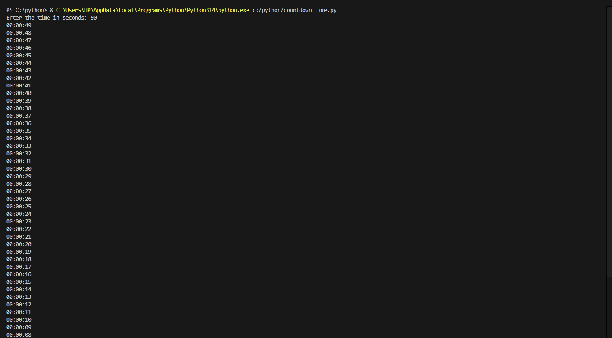
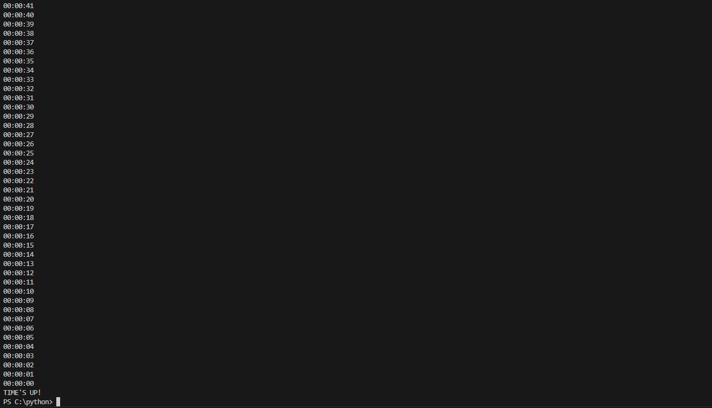

# COUNTDOWN TIME

### DESCRIPTION

    This act as a stopwatch count down the clock when a user specifies the time.

### Steps taken to develop the project

---

1. First step it to import time.
2. Next step will specify the input where the users can specify from which time dey would love the timer to start from.
   ```py
       my_time = int(input("Enter the time in seconds: "))
   ```
3. The next step is to put it in a loop that will keep on counting the number till it gets to the end
4. Then write functions to calculate seconds, minutes, and hour then print them out.

## OUTCOME EXECUTION





